# 常用IDE

> 计算机没有通天大道，只有一步一个脚印的坚实

~~安装不易~~，软件安装由高品质到低品质

## 安装 and 运行

第一步就是给电脑添加c++的编译环境，大部分情况新手用的都是一个叫mingw的工具包，我觉得应该很少有人用cmake了，
mingw中的GCC是编译c语言的，g++是编译c++的。

有个极简办法，windows系统下有个叫scoop的工具,在开始页面搜索powershell，然后输入scoop install mingw其实就o了，我也推荐另一个叫make的编译工具，scoop install make就可以安装了
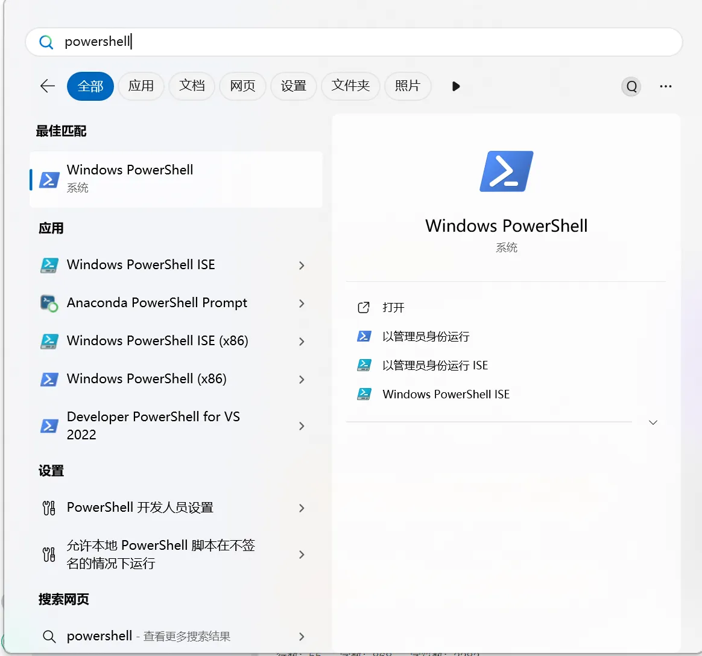


这个mingw可以看成一个工具包，里面有gcc，g++，还有一大堆东西，这个装可能会装很多环境，导致你不知道里面有点啥，但是未来可能某个时候就用上了

至于scoop甚至还可以scoop install python直接就装完了，不用去官网，可以说小白必备。

用gcc --version 来看看有没有这个东西，有这个东西的版本那就肯定安装成了


如果要是报错了一大堆红，那说明你的电脑没有scoop，
可以在powershell中输入下面的命令(# 开头的都是注释，不需要输入)
```
-> 以管理员形式打开

# 设置 PowerShell 执行策略
Set-ExecutionPolicy -ExecutionPolicy RemoteSigned -Scope CurrentUser
# 下载安装脚本（要以管理员方式打开）
irm get.scoop.sh -outfile 'install.ps1'

-> 切换成普通powershell
# 执行安装, --ScoopDir 参数指定 Scoop 安装路径(不能用管理员)
.\install.ps1 -ScoopDir 'C:\Scoop'
```

就可以成功安装scoop

要是实在不想搞命令行，就只能手动装吧，具体可以参考:
[博客-如何安装Mingw](https://blog.csdn.net/lmrybc49/article/details/146039552?ops_request_misc=elastic_search_misc&request_id=0728cb75c6e7b47c09cdfccc933e3a4f&biz_id=0&utm_medium=distribute.pc_search_result.none-task-blog-2~all~top_positive~default-1-146039552-null-null.142^v102^pc_search_result_base9&utm_term=mingw%E5%AE%89%E8%A3%85&spm=1018.2226.3001.4187)。由于手动安装scoop的难度比较大，所以如果没有的话，不推荐大家去安装这个东西。

接下来就是安装各种编写代码的地方
### Clion

首先打开[JetBrains官网](https://www.jetbrains.com/)

往下翻找到Clion软件
当然推荐其他的IDE,比如python的pycharm，java的IDEA（除了CLion其他都分专业版和社区版，专业版要付费，但真正开发还得是专业版，对学生来说可以申请学信网认证，申请一年，到期继续续）~~由于不收费，实际体验下来我觉得Clion是三个里做的比较不好的~~，由于jetbrains的高度集成，即使不安装Mingw似乎也是可以去直接跑代码的，给了新手一个轻易上手的机会。


点击DownLoad

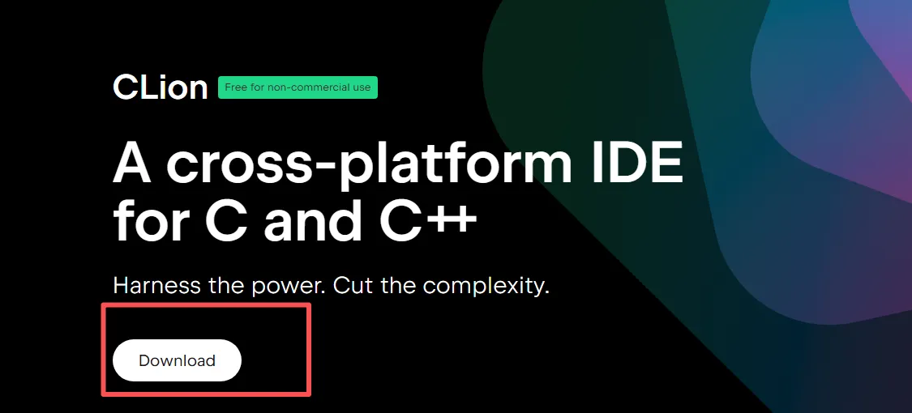

选择自己的操作系统，现在大部分电脑应该都是win11了，当然不排除你是苹果电脑的可能，或者喜欢用linux开发(暂不推荐)


点击download，过一段时间就开始安装exe文件了，(截止2025.8.28最新版是2025.2，我还在用2025.1.3.1)

然后开装


选个安装位置


全选即可


然后最后一步点安装,最大的遍历就是不用自己添加PATH,刚才勾选的选项就有，后面就会看到vscode这一缺陷了，然后创建关联里勾选了cpp(c++)和c，这里说一下，**c++的文件中是可以编写c程序的**。

接下来选择语言，同意协议，然后不发送请求一系列经典软件安装操作

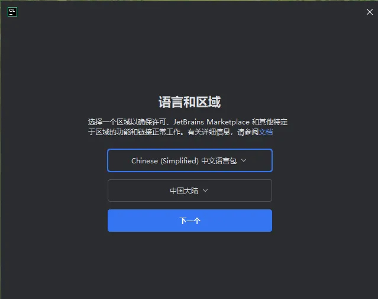

主要是这个界面，选择非商业用途


需要自己注册一个账号，微信，谷歌，邮箱等都可以，看自己一般用哪个，这个过程就可以直接省略了

接下来就是**使用环节**了,先new一个Project也就是我们要写的项目（你可以理解成一个大文件下有很多小文件）

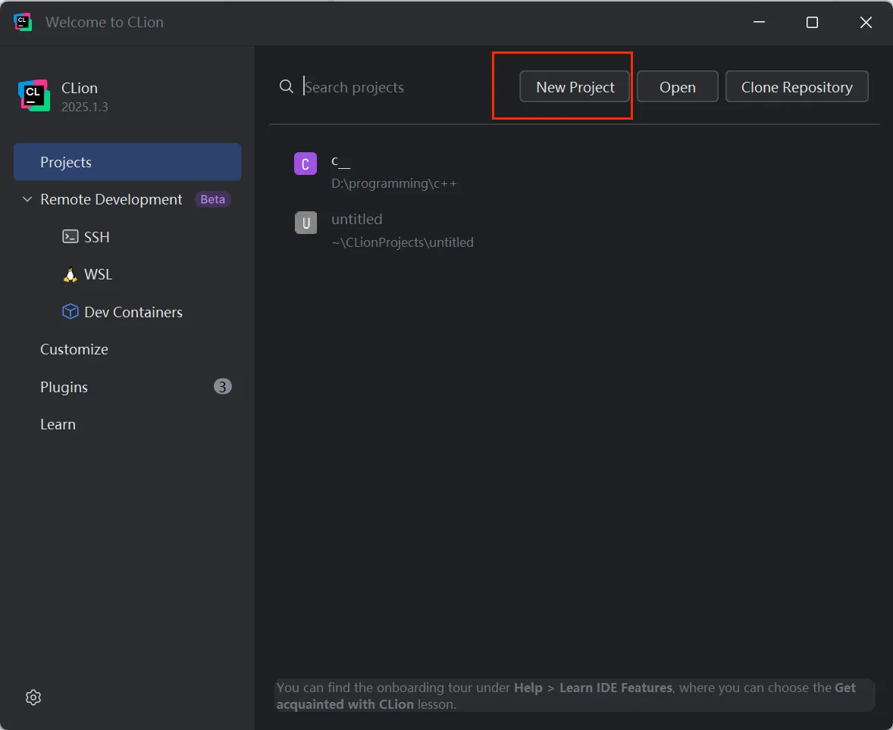

选择项目文件存放地址和自己要用的C++版本


等待一会儿自动添加编译器，然后自己就能开始写代码了


如果右上角这两个亮了，证明你配置对了，第一个是运行程序，clion会自动生成cmakelist文件，就是能让程序跑起来，第二个是调试程序(放最后说)

顺便关一下代码提示补全
[参考一下这个链接](https://blog.csdn.net/qq_44846784/article/details/145366224?ops_request_misc=elastic_search_misc&request_id=e8dfdbcf9b08ea8c9c8f2ff24a8439f4&biz_id=0&utm_medium=distribute.pc_search_result.none-task-blog-2~all~sobaiduend~default-1-145366224-null-null.142^v102^pc_search_result_base9&utm_term=clion%E5%85%B3%E9%97%AD%E8%87%AA%E5%8A%A8%E8%A1%A5%E5%85%A8&spm=1018.2226.3001.4187)


##### 可能现在意识不到clion的强大，但真正学开很多底层知识的时候发现有很多实用的功能

### Vscode

首先打开
[vscode官方链接](https://code.visualstudio.com/)

点击中间大大的download按钮

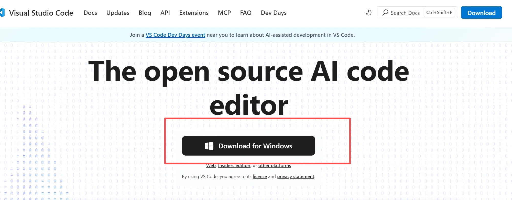

接下来有的可能要选择是什么系统，有的可能就直接跳转到下载了(因为我虚拟机和电脑的界面就不一样，选完windows系统就自动开始下载了)
然后运行下载好的exe

同意，下一步

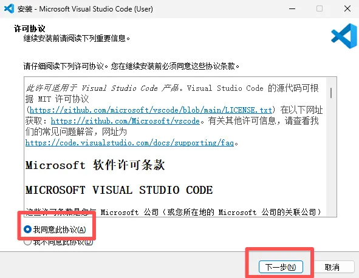

放一个位置


下一步之后再下一步，
全选就可以了这里主要是创建一些快捷方式。


安装好之后


这里就可以打开文件夹了，就是你要写代码的地方，中途会跳出来一个是否信任该文件，信任就可以了。

主要用前两个，第一个是新建文件，第二个是新建文件夹


假设我现在写了一段代码


如果你翻阅了网上很多教程,这里就开始复制粘贴改各种的配置了。插件的部分我们再说，但是js文件你只会找，然后还有一大堆头疼的问题，还没开始呢就已经弃坑了，这里我想说的就是，**很多计算机课程不联系是学计算机最大的一个问题**，这部分知识其实是计科导实验的部分，不多说了，直接说解决办法


新建一个终端，这就是常说的黑框框（包括第一下的powershell也是）如果你用过vs就会发现他是分离式的，而vscode的是直接展示在下面的

还记得刚开始的mingw么，里面包含了g++，使用
```c
g++ hello.cpp // g++ 加上文件名字
./a.exe       // 运行文件使用./生成的exe名字
.\a.exe       // 都一样的
```
**一般来说g++生成的都是a.exe**
也可以用make（前提是你用scoop装了）
```c
make hello // 不加文件后缀名
./hello.exe // 运行
.\hello.exe //也可以
```
**make会直接生成其所对应的exe文件**


鄙人觉得make比g++好用。
这就是命令行式与程序进行交互，这才是一个程序员需要干的，学以致用。~~不是大部分时间配环境都需要ctrl c/v~~

当然不配置各种js文件，另辟蹊径的路也是有bug的
```
g++ hello.cpp
```
C:/mingw64/bin/../lib/gcc/x86_64-w64-mingw32/15.2.0/../../../../x86_64-w64-mingw32/bin/ld.exe: C:/mingw64/bin/../lib/gcc/x86_64-w64-mingw32/15.2.0/../../../../x86_64-w64-mingw32/lib/../lib/libmingw32.a(lib64_libmingw32_a-crtexewin.o):crtexewin.c:(.text.startup+0xb4): undefined reference to `WinMain'

然后报了一大堆不懂的错误，这里涉及到了很多隐晦而又底层的东西，我希望你能够在未来的学习旅途中，逐步去理解为什么会发生这样的问题。我们这里只讲解决方案

将main()改成WinMain()即可
```c++
#include <iostream>
using namespace std;

int WinMain()
{
    cout << "hello world" ; 
    return 0 ;
}
```

##### 看到这里其实已经老眼昏花了感觉，但是说实话计算机没有好走的路。

这里的具体操作参考了哈佛大学的cs50课程，有兴趣可以去b站上看一看，主要是教编程入门(C + Python + HTML,CSS,JS初步)的，也是命令行+程序的开发，希望能够有所帮助。

以上所有指令适用于CLion中，但是CLion中点下按钮就能自动进行G++能一系列操作，而网上的各种教程也只是帮你配置如何点按钮自动执行罢了。

另一种方法就是配环境，如果不喜欢命令行的操作，不喜欢和powershell打交道，那就去[博客-保姆级配置vscode](https://blog.csdn.net/weixin_60915103/article/details/131617196?ops_request_misc=elastic_search_misc&request_id=755b9cf175556db7cc6525df4b147150&biz_id=0&utm_medium=distribute.pc_search_result.none-task-blog-2~all~top_click~default-2-131617196-null-null.142^v102^pc_search_result_base9&utm_term=vscode%E7%8E%AF%E5%A2%83%E9%85%8D%E7%BD%AE&spm=1018.2226.3001.4187)，可以说五天计算机，三天配环境。

这里如果大家选择走命令行的话，调试会很痛苦，如果选择走配环境的话，那么配起来会很痛苦。

### Visual Studio

依旧打开[官方链接](https://visualstudio.microsoft.com/zh-hans/downloads/)
，选择社区的免费下载


然后就开始安装了，安装好后运行下载好的exe文件，然后点击继续，跳到下面的界面


往下翻，找到C++桌面开发**和Visual Studio扩展开发(图里没展示)**，勾选，右面会发现有一栏叫做**可选**的东西，我的评价是我基本没用到过，而且当时也不知道这些都干啥的，直接安装了，占了电脑10.66G一言难尽。所以我是非常不推荐这个重量级选手的(安装的记得改安装路径)

* 扩展开发主要是帮你加一些工具，比如代码补全，代码高亮，git工具等


打开之后，创建新项目

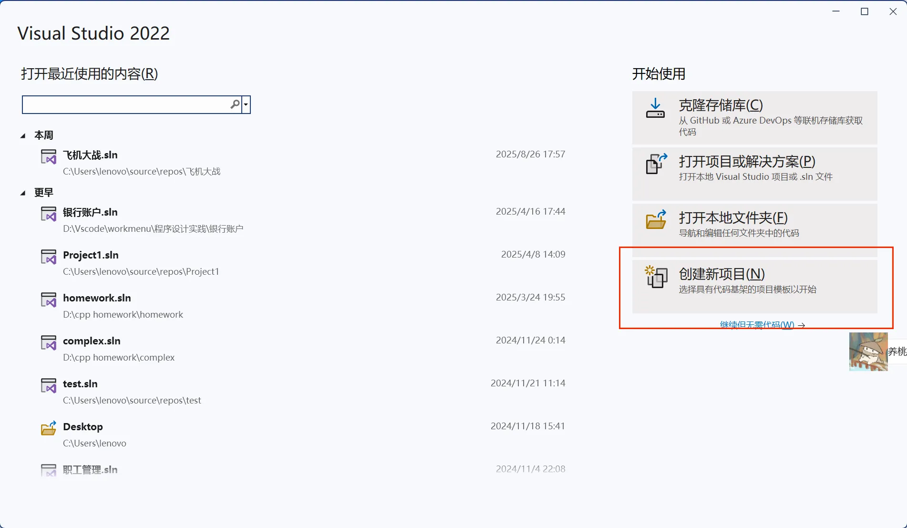

创建空项目

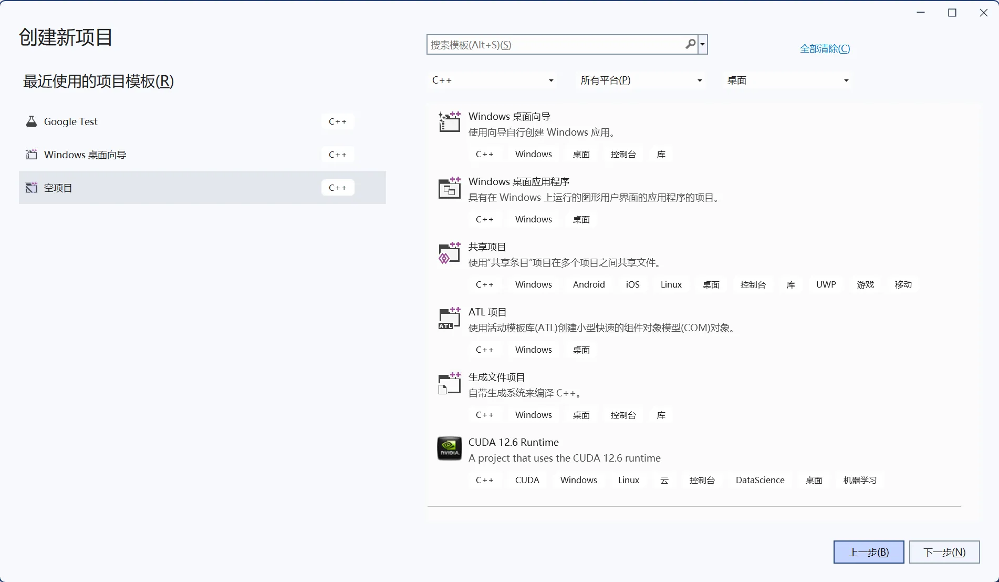

填写项目名称和存放位置这个和Clion差不多

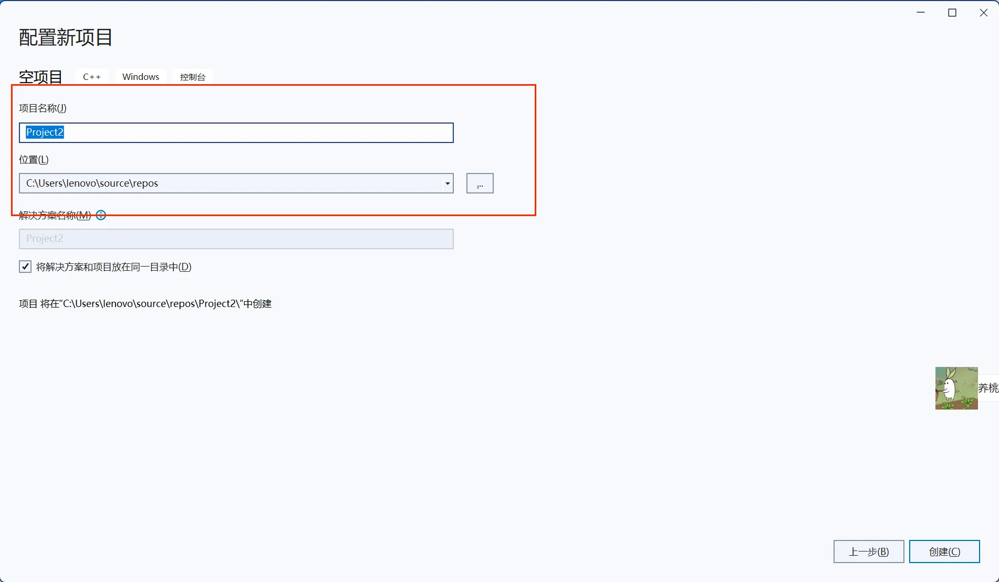

右键源文件这里就是放cpp文件,然后添加新建项


选择cpp文件，然后改个名字


写完代码点击绿色的三角运行就可以了

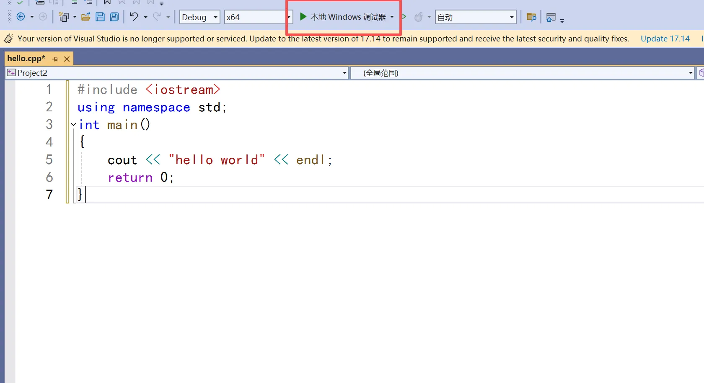

### Dev C++

依旧打开[官方链接](https://sourceforge.net/projects/orwelldevcpp/)~~下吧一下一个不吱声~~

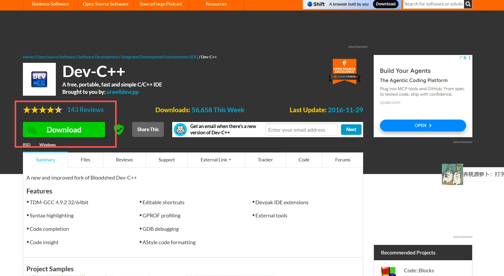

然后运行exe文件，没有中文，只能选英文了。

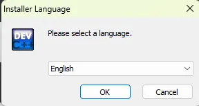

然后接下来就是I agree,next最后选择安装路径装完就行了。

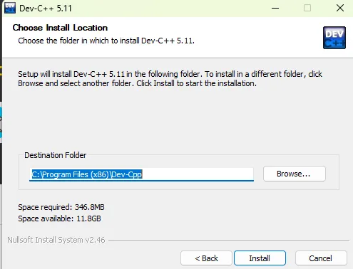

打开软件，这里能选中文了。


这里自己搭配一下颜色主题之类的，有些字体很抽象，建议不要选。


选择文件里面的新建然后有一个源代码

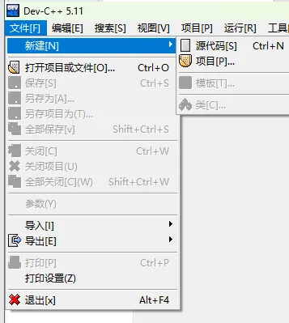

这里用一个很抽象的字体写了代码


左上角选择编译运行，会有一个保存的过程，保存到你写代码的位置。


最后代码就跑起来了

这几个就是常用的IDE了。

## 调试

### Cliom

这是一段求1到n和的代码

```C++
#include <iostream>
using namespace std;

int main() {
    int n;
    cin >> n ;
    long long sum = 0;
    for (int i = 1; i < n; ++i) { 
        sum += i;
    }
    cout << sum << endl ;
    return 0;
}
```
输入5 输出10，不知道哪里有问题

鼠标放在行号左侧，点击设置一个**断点**，就是指从哪里开始调试


然后点那个小虫子一样的debug,为什么设置成小虫子样子，可以参考一下bug的来源历史


初学者需要知道四个东西我，向下箭头是下一步，向下箭头左边是跳过整步，variables显示每个变量实时的值，console是对接输入输出的。遇到要输入东西的地方就在console，需要要cin，cout的建议跳过整步，防止进入一些奇奇怪怪的东西，然后遇到循环可以一步一步走，每步监视variables里的东西。


由于一些特殊原因调试的时候，可以用一个具体值，就不要用cin了，因为他的调试会把cin的底层也翻出来
比如我拿n = 5.

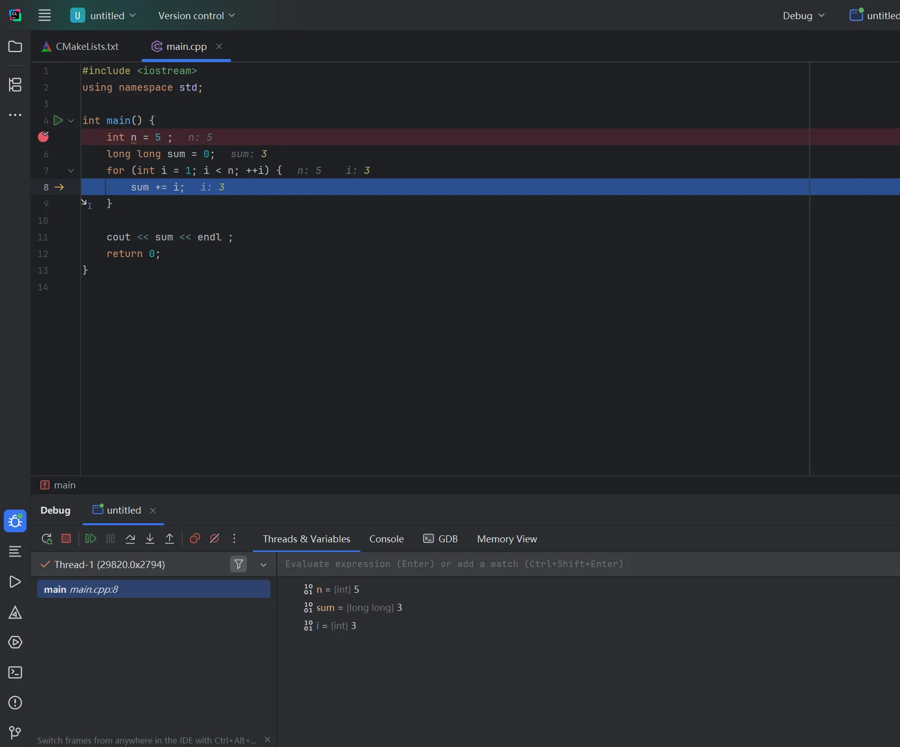

[有关CLion从安装到调试](https://blog.csdn.net/weixin_41287260/article/details/147117976?ops_request_misc=elastic_search_misc&request_id=5c731d36659c6b5ca6df03187088fff6&biz_id=0&utm_medium=distribute.pc_search_result.none-task-blog-2~all~sobaiduend~default-1-147117976-null-null.142^v102^pc_search_result_base9&utm_term=Clion%E4%BB%A3%E7%A0%81%E8%B0%83%E8%AF%95&spm=1018.2226.3001.4187)这篇博客我感觉是十分优质的，但有很多计算机的术语，重点看调试部分就可以了


其他的也差不多，只要找到调试这个按钮都大同小异，这个过程就是这样，**不要直接把自己的错误代码扔给测试平台**，说来惭愧，开始写java的时候才发现调试和测试驱动开发的重要性，我觉得这个点gradescope平台就做的特好，再交就要等好几个小时，必须要自己学会调试


### VS

vs的也需要先设置断点


先按F10，然后找要监视的变量(Clion里会直接帮我们找全部的)
监视：
操作为 调试 窗口 监视

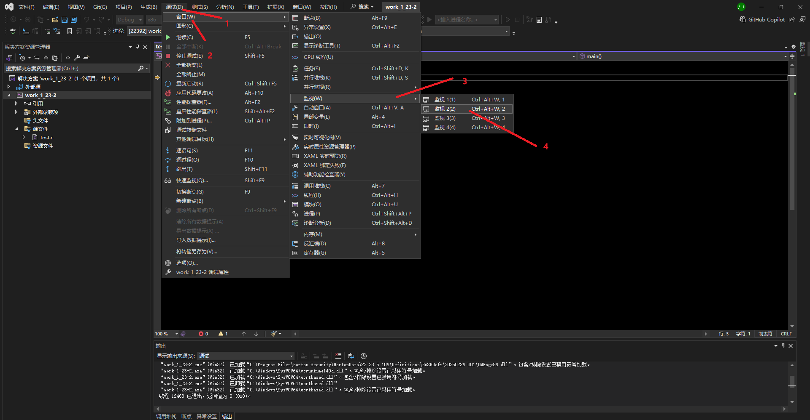

然后开始找到监视，输入你要监视的变量

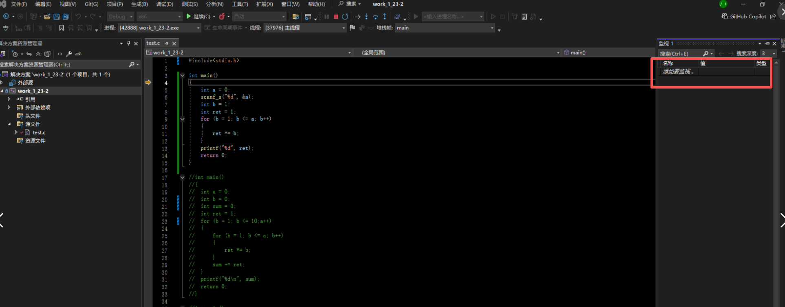

vs里面是分为逐语句和逐过程，下图左面是逐语句，右面是逐过程，调试方法就同Clion了。


也可以直接点击开始调试或者逐语句，现在的IDE都很智能，都会知道你要干什么，所以你要干的就是学会Debug。


### vscode

如果你看了上面的博客，配好了环境，大概率是可以直接按调试按钮直接调试的，就会有这样一个选择按钮，然后设置断点，点击debug就可以了，和其他IDE大同小异。


如果你选择了命令行，
vscode的调试需要用到GDB，这就交给你的计算机导论实验课吧，当然网上找个教程，也可以走一下便捷的路途，但是我十分推荐学一下命令行的一些指令，这是一个十分痛苦的过程，当时学[Missing Lecture](https://missing.csail.mit.edu/2020/)这节课，崩溃到让我想放弃计算机，命令行的强大真的是我无法想的。~~所以计算机科学导论真的不是水课，只是我没学到东西~~。

### dev

dev的调试也很简单，掌握了前面的就差不多了。

[dev的从0到1开发](https://blog.csdn.net/sita1207/article/details/104303625?ops_request_misc=&request_id=&biz_id=102&utm_term=dev%E4%BB%A3%E7%A0%81%E8%B0%83%E8%AF%95&utm_medium=distribute.pc_search_result.none-task-blog-2~all~sobaiduweb~default-1-104303625.142^v102^pc_search_result_base9&spm=1018.2226.3001.4187)可以看这篇文档，~~绝对不是助教太嫌弃devc++，所以卸载了。~~

## 插件的使用

这里主要介绍的是vscode中好用的插件。

找到这个图标


### CodeSnap

代码截图软件，选中你要截图的代码右键选择CodeSnap


点一下这个圈圈就可以了


### vscode-icons

更好的图标显示


纯属长得好看一点了


### Chinese Language

我知道你讨厌英文。


### C/c++ Extension Pack

一个c++的扩展包能够帮你去实现代码扩展功能


代码高亮以及这种tab补全好像这个包做的都挺好的

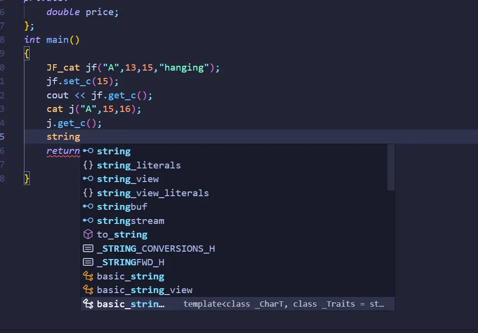


至于有的扩展包可能是用java的，可能是latex的，可能是jupyter的，这些暂时用不到c++里面实用的就那几个了。

对于CLion来说，双击shift，搜索plugins

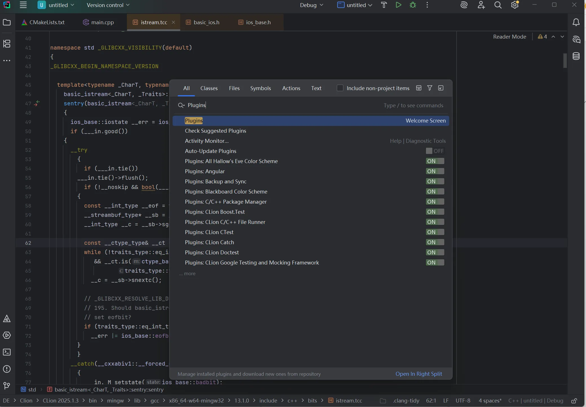

由于Clion的集成度做的很高了，所以大部分插件，都是在编译优化上的，比如Cmake，Markdown，所以暂时不需要安装什么

对于vs来说，在扩展里面的管理扩展中


同样这些扩展对于现阶段而言没有太重要的。

我推荐的使用顺序时，刚开始学c++可以用vscode，然后之后去搜搜有关配vscode环境的博客，在学完c++之后要学各种多文件编写，比如你要做个游戏之类的，可以使用CLion。当然所有的IDE不分高下，也可以选择vs和dev这里没有强制性要求。

## IDE代码技巧

很多时候你会发现你的代码编程速度很慢，我这部分补充的是最基本的一些操作，很遗憾这部分大部分人都是在看别人编码的过程中学到的，我非常推荐的建议是

* "抠"掉自己的小键盘区的数字，用主键盘区的数字以及加减乘除符号，这里对有外设键盘的人就很棒，练习自己的敲代码速度，我知道这个过程真的很痛苦，因为我就是这样过来的。

* 程序员可能最初知道的就是Ctrl+A，Ctrl+C/V，但是在vscode和CLion里我认为Ctrl+X剪切掉整行挺好用的，不知道算不算一个小技巧。
  
* 按住shift然后按上下左右可以选中某块区域，这个技巧可以说是我看别人写代码然后查阅才知道的，因为当时选中代码只会用鼠标，这样减慢了删代码的速度。
  
* 选中某块代码tab可以整体缩进，但是很多人不知道shift+tab是向左整体缩进。
  
* 当你敲了左括号[的时候，IDE一般会自动补全右括号[] ,这时候光标在括号里，如果按了右括号]，会自动跳出括号，这个技巧很重要,防止多敲括号，而且真正提高了编程速度，以后一旦要出括号直接按一下]就可以，不用按方向键。{}也同理，按住shift+右花括号可以直接出括号。
  